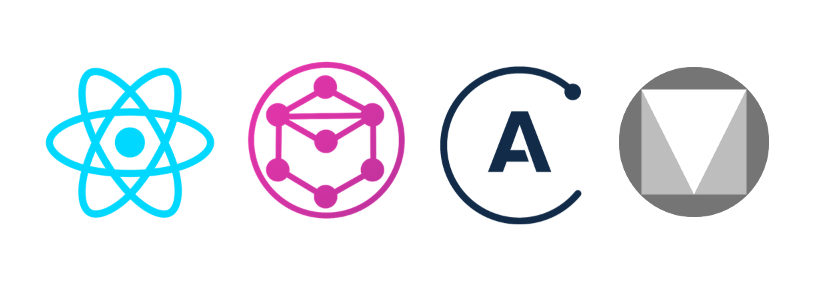

  

This project is a boilerplate for creating applications based on [React](https://reactjs.org/)/[GraphQL](http://graphql.org/)/[Apollo](https://www.apollographql.com/)/[Material](https://material.io/).  

We're using some core concepts of all of those technologies and creating some new concepts as well, aiming to have a fast, painless and pleasant development experience, even with complex software requirements.  

This is a working progress project, but we're already using some of the concepts here in production and we're confident that this structure, concepts, conventions and technologies are worth it to invest on.  

## Table of Contents

- [Technologies](#technologies)
- [Concepts](#concepts)
- [First steps](#first-steps)

## Technologies

**GraphQL** is *de facto* the new standard for creating great APIs.  
It's easy to consume, easy to implement, easy to integrate and a lot more of nicer things.  
We recently stumble on the awesome [PostGraphQL](https://github.com/postgraphql/postgraphql) project, which generates a GraphQL API by reflection over a PostgreSQL schema.  
We always loved PostgreSQL and we were implementing GraphQL for a new application, so **PostGraphQL** fitted like a glove for us 😀  
With PostGraphQL we can focus on the database schema modeling, entities, relationships, etc., and then PostGraphQL do its magic and we have a great GraphQL API for our applications.  

There's a lot of front-end libraries out there, and we are still experimenting all of those, even that just for fun, but **React** seems to be (at least now) a good choice for the kind of projects we're building at Nasc.  
GraphQL and React were built by Facebook, but it's not that easy to integrate them, that's where **Apollo** appears.  
Apollo provides a universal GraphQL API on top of your existing services.  
Basically, Apollo binds data to the UI (React in our case), but it does a little more usefull things, like caching responses.  
I'll tell you the API is not that beautiful, but with workaround here and there, you're good to go.  

Talking about interface, we need a cool and fancy style guide for our components.  
[Google Material(https://material.io/) give us that and more.  
We're using the great [MaterialUI](https://material-ui-next.com/), which are React components that implement Google's Material Design.  

That's it.  
Of course we're using other technologies and projects as well, like [Create React App](https://github.com/facebookincubator/create-react-app), but the mentioned above are the main ones.  

## Concepts
The concepts behind this boilerplate are very attached to the technologies involved itself.  
We encourage you do adopt the folder structure and conventions to achieve a satisfactory development experience.  

### Folder structure
We're extending Create React App structure.  

```
react-graphql-apollo-material-boilerplate
├── package.json
├── public
│   ├── favicon.ico
│   ├── index.html
│   └── manifest.json
├── README.md
├── src
│   ├── components
│   │   └── app
│   │       ├── index.css
│   │       └── index.js
│   ├── index.css
│   ├── index.js
│   ├── lib
│   │   ├── apollo.js
│   │   └── util.js
│   ├── logo.svg
│   └── registerServiceWorker.js
└── yarn.lock
```

All components should be placed inside the `src/components` directory.  
We're using the sub-components strategy, where we nest all related components.  
For example, if we have a `customer` entity in our application and we'll have different components related to this entity, everything should stay inside a top level `customer` dir.  
```
src/components/customer/
├── edit
│   └── index.js
├── list
│   └── index.js
├── new
│   └── index.js
├── index.css
├── index.js
└── graphql.js
```

You can put all JavaScript helper code inside the `src/lib` dir.  
All Apollo related stuff should be in the `apollo.js` file.  
For now, we're just creating the Apollo client:  

```javascript
export const client = new ApolloClient({
  link: new HttpLink({ uri: 'http://localhost:5000/graphql' }),
  cache: new InMemoryCache()
})
```
Note that here is the place you must change your GraphQL endpoint.  
We probably could evolve this to a top level configuration file soon.  

## First Steps
